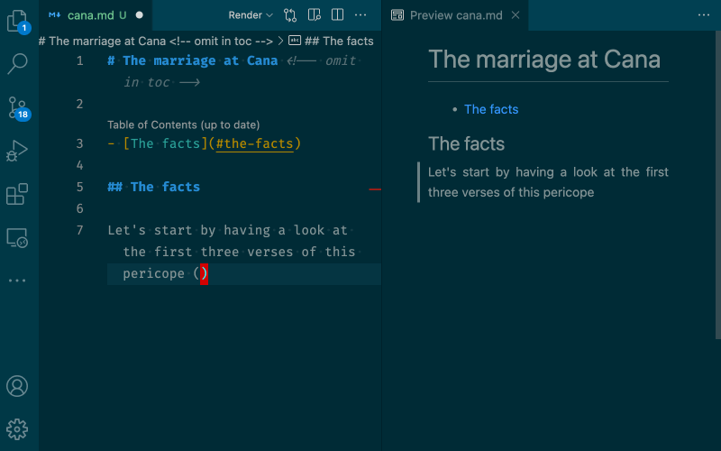
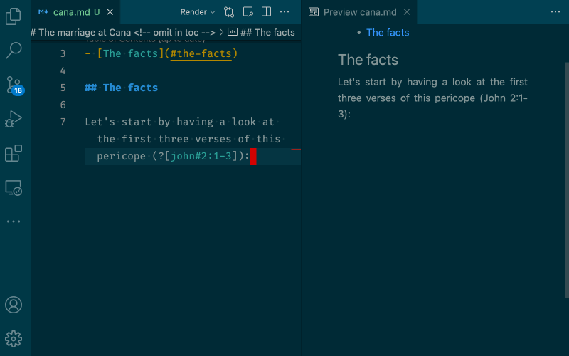

# Markdown Scripture <!-- omit in toc -->

[](https://travis-ci.com/swils/vscode-markdown-scripture)

Allow your Markdown notes in VS Code to track references and include quotes from verse-based documents such as the Bible.

## Table of Contents <!-- omit in toc -->

- [Features](#features)
  - [Referencing and including verses](#referencing-and-including-verses)
  - [Full compatibility with Markdown syntax](#full-compatibility-with-markdown-syntax)
- [Configuration](#configuration)
  - [Adding sources included with extensions](#adding-sources-included-with-extensions)
  - [Providing your own sources](#providing-your-own-sources)
    - [Specifying the location of your own sources](#specifying-the-location-of-your-own-sources)
  - [Including multiple sources](#including-multiple-sources)
  - [Changing the verse numbering layout](#changing-the-verse-numbering-layout)
- [Future plans](#future-plans)
- [Contributing](#contributing)
- [Issues and requests](#issues-and-requests)
- [Release Notes](#release-notes)

## Features

Git + Markdown + VS Code (+ the many excellent VS Code extensions for enhanced Markdown) is a very powerful combination of tools for keeping notes on *any* topic.

With the **Markdown Scripture** extension, you can leverage these powerful knowledge management tools for Bible study. Markdown Scripture allows you to easily reference and even include scriptural verses in your Markdown notes.

### Referencing and including verses

Referencing verses is very simple, using a mostly familiar format of `?[john#3:16-17]`. For actual *inclusion* of the quoted verses, instead of passive referencing, use an exclamation mark: `![john#3:16-17]`. Multiple ranges can be specified: `?[john#2:1,4-5]`. When a reference cannot be resolved, it is displayed with distinctive markup.



### Full compatibility with Markdown syntax

All other Markdown markup remains available. For instance, you can use tables to compare multiple translations or to place multiple synoptic Gospels side by side:



## Configuration

You need to properly configure the Markdown Scripture extension to look for biblical *source documents* and to make those sources available in your Markdown notes. You can currently add sources in two ways (both ways can be mixed in a single project):

1. Bibles included with VS Code extensions, including the Markdown Scripture extension itself.
2. Providing your own Bible(s), locally, within your own notes project.

As with any VS Code extension, the required configuration can be global or local (*local* meaning the project workspace in which you keep your notes). In the following sections, we'll assume that you will configure Markdown Scripture *locally*, in a workspace.

### Adding sources included with extensions

Currently, the Markdown Scripture extension itself only includes a *single* translation of the Bible: the publicly available Challoner version of the Douay-Rheims Bible (see [SOURCES.md](SOURCES.md) for more details). The set of included sources [may be expanded in the future](#future-plans).

To use the included DRC translation, add the following to your workspace configuration (e.g. for a project `mynotes`, that would be `mynotes/.vscode/settings.json`):

```json
{
  // ...other config...
  "markdownScripture.sources": [
    { "extension": "swils.markdown-scripture", "include": "en/drc", "ref": "${filename}" },
  ]
}
```

The `extension` key tells Markdown Scripture to look for a Bible included *within some extension*. (Obviously, `swils.markdown-scripture` is the published name of the Markdown Scripture extension itself.)

The `include` key specifies *which* of the Bibles included with this extension you want to add. As mentioned earlier, the Douay-Rheims-Challoner translation (`en/drc`) is currently the *only* Bible included with Markdown Scripture.

Each book in a Bible is stored in a separate Markdown file. For instance, `john.md` stores the Gospel of John and `ps.md` stores the Book of Psalms (see [SOURCES.md](SOURCES.md) for a full overview of all books and their filenames). The `ref` key tells Markdown Scripture *how* you want the books of the specified Bible to be made available for referencing. Since we only add a single Bible in the above example configuration, we make each book of that Bible available using *only* its filename. For instance,

* the reference `?[john#3:16]` will point to John 3:16;
* the inclusion `![ps#8:2-3]` will include Ps 8:2-3.

See below for information on how you can use the `ref` key to provide *multiple* Bibles simultaneously in a single workspace.

### Providing your own sources

If you want to use your own source documents, such as your own Bible translations, these files can be placed at any location inside the VS Code project where you keep your Markdown notes.

These sources are also just Markdown text documents, but with annotations for chapters and verses. The annotation format was chosen to be lightweight and in line with typical Markdown conventions. You can look for examples within the [Markdown Scripture source code](https://github.com/swils/vscode-markdown-scripture/tree/master/data). (The format may change in the future to support new features and edge cases.)

Chapters are marked with HTML comment tags of the form `<!-- scripture:... -->`. For instance:

```markdown
## Chapter 2 <!-- scripture:2 -->
```

When Markdown Scripture encounters an annotation like this, it understands that any verses it encounters, from this point until the next chapter marker or until the end of the document, is part of chapter 2 of this document.

The beginning of a verse is marked inline inside regular text paragraphs, using rectangular brackets `[` and `]`. A verse runs until the next verse marker or until the end of the paragraph:

```markdown
## Chapter 2 <!-- scripture:2 -->

[1] And the third day, there was a marriage in Cana of Galilee: and the mother of Jesus was there. [2] And Jesus also was invited, and his disciples, to the marriage. [3] And the wine failing, the mother of Jesus saith to him: They have no wine.
```

Many source texts for translations can be downloaded from the web and annotated using VS Code's powerful regex find-and-replace support. If you have annotated a publicly available Bible translation and consider the result to be of proper quality, you can always contribute it by inclusion in a public extension (see [Contributing](#contributing) for more details).

#### Specifying the location of your own sources

While it is entirely up to you *where* to put your own source files inside your project, it is necessary to keep texts belonging to the same translation *within the same folder*. We also recommend to respect [the filename conventions](SOURCES.md) for the various books of the Bible.

As an example: imagine that we put the files for a Dutch translation of the Bible (Petrus Canisius) in a local project directory `sources/can1939`. The following configuration instructs Markdown Scripture to make those source files available as references:

```json
{
  // ...other config...
  "markdownScripture.sources": [
    { "include": "sources/can1939/*.md", "ref": "${filename}" },
  ]
}
```

As you can see, in contrast to adding an included Bible, we didn't specify an `extension` key in this configuration. And the `include` key is now a *glob pattern*. The result of this configuration is that the reference `?[john#3:16]` will point to John 3:16, as found in the local file `sources/can1939/john.md`.

### Including multiple sources

Because we strongly recommend everyone to use [the same filename conventions](SOURCES.md) for the books of the Bible across different translations, when adding multiple Bibles to a single project, we need to be able to distinguish them in our references.

For instance, imagine that we want to use both the DRC included with Markdown Scripture and a locally provided translation (Petrus Canisius). Since both contain a Gospel of John stored in a file named `john.md`, we need to avoid name clashes in our references. The following example configuration does just that:

```json
{
  // ...other config...
  "markdownScripture.sources": [
    { "extension": "swils.markdown-scripture", "include": "en/drc", "ref": "drc/${filename}" },
    { "include": "sources/can1939/*.md", "ref": "${filename}" },
    { "include": "sources/can1939/*.md", "ref": "can1939/${filename}" },
  ]
}
```

Here, Markdown Scripture is instructed to add *two* different translations, using *three* different reference formats:

* `?[john#3:16]` will point to John 3:16 in the Petrus Canisius (`can1939`) translation;
* `?[can1939/john#3:16]` will *also* point to John 3:16 in the same Petrus Canisius translation;
* `?[drc/john#3:16]` will point to John 3:16 in the DRC translation.

### Changing the verse numbering layout

The way VSCode renders Markdown [can be tweaked with custom CSS](https://code.visualstudio.com/docs/languages/markdown#_using-your-own-css).

So in the settings file for your project add a line like:

```json
"markdown.styles": ["style.css"]
```

All verse numbers generated by Markdown Scripture are wrapped in a `span` element with CSS class `md-scripture-verse-num`. This means that the file `style.css` in your project can contain something like this:

```css
.md-scripture-verse-num {
  vertical-align: super;
  font-size: 0.8em;
}
```

## Future plans

* **Customizable book names**.

  Some people will prefer `john`, others will prefer e.g. `jn`. It is desirable to maintain conventions for book filenames (`john.md` for the Gospel of John, regardless of translation), but to make them available in your notes using customizable and localized keys.

* **Partial verse references**.

  Sometimes a new pericope begins in the middle of a verse. It would be nice to be able to "split" such verses in a reference.

* **Expand the set of available translations**.

  The set of available source documents may be expanded in the future to include more languages and multiple relevant editions. These can be made available either within the main extension, or through separate extensions, depending on how things work out. Either approach will undoubtedly benefit from user contributions (see [Contributing](#contributing)).

* **Clickable links**.

  Clicking your references should open the original text to which the reference links.

* **Note templates**.

  Given a pericope (or any given range of verses), it would handy to automatically create the scaffolding for a verse-by-verse commentary on that pericope, using a fixed template.

* **Support for a broader set of classical documents**.

  Markdown Scripture depends on a text having small enough parts which are numbered (verses or paragraphs), to allow referencing and inclusion. Next to the Bible there are other texts (e.g. the Summa Theologica or the Catechism) which Markdown Scripture could also support. This requires a more general annotation system which goes beyond chapters and verses.

* **Integration with other Markdown extensions**.

  The VSCode marketplace has a number of very nice extensions for general cross-referencing across notes, with support for `[[wiki-links]]`, backlinks and `#tags`. It would be cool if the Scripture references are integrated with e.g. the backlinks mechanism of the most popular extensions.

... and many other things, given enough time :-)

## Contributing

If you want to contribute something, or if you need help setting up your own extension to distribute source documents, contact me privately; or open an issue or PR at Github:

* [https://github.com/swils/vscode-markdown-scripture/issues](https://github.com/swils/vscode-markdown-scripture/issues)

## Issues and requests

Issues with this extension or feature requests can be reported here:

* [https://github.com/swils/vscode-markdown-scripture/issues](https://github.com/swils/vscode-markdown-scripture/issues)

Before reporting an issue, make sure to check whether the issue has already been reported.

## Release Notes

See [CHANGELOG.md](CHANGELOG.md).
